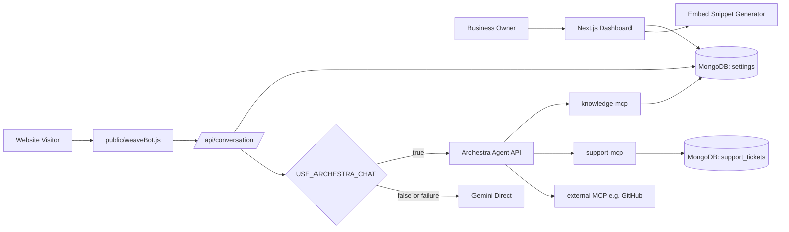
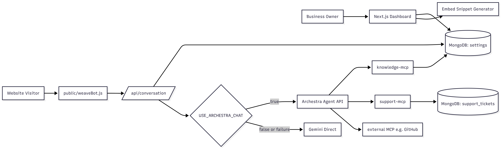

# BotWeave

BotWeave is a multi-tenant support chatbot platform where a business owner configures support context once, embeds one script, and gets live AI chat on any website.

The app has two runtime modes:
1. Direct LLM mode (Gemini fallback path).
2. Archestra orchestration mode (agent + MCP tools + optional external MCP tools like GitHub).

## Project Goal

Build an embeddable support assistant with:
1. Fast onboarding for business owners.
2. Owner-scoped answers grounded in saved knowledge.
3. Optional tool orchestration through Archestra + MCP.
4. A demo-ready architecture with observability and governance.

## Architecture



<!-- Image -->



## End-to-End Flow

1. Owner authenticates via Scalekit (`/api/auth/signin`, `/api/auth/callback`).
2. Owner saves `businessName`, `supportEmail`, and `knowledge` from dashboard.
3. App stores owner config in MongoDB (`settings` collection).
4. Owner copies script from `/embed` and adds it to their site.
5. Widget sends `{ ownerId, message }` to `POST /api/conversation`.
6. Conversation route loads owner settings and builds a constrained support prompt.
7. Route calls Archestra agent when `USE_ARCHESTRA_CHAT=true`; otherwise calls Gemini directly.
8. If Archestra fails, route falls back to Gemini (requires `GEMINI_API_KEY`).

## Repository Map

- `src/app` - Next.js App Router pages and API routes.
- `src/components` - landing, dashboard, and embed UI.
- `src/lib` - DB connection, Scalekit client, session helper, Archestra client.
- `src/model/settings.model.ts` - owner settings model.
- `public/weaveBot.js` - embeddable widget script loaded on customer sites.
- `mcp/knowledge-server` - MCP tools: `search_faq`, `get_policy`, `get_contact`.
- `mcp/support-server` - MCP tools: `create_support_ticket`, `get_support_ticket_status`.
- `scripts/archestra/archestra-setup.mjs` - idempotent Archestra registration + agent/tool assignment.

## API Contract (Current)

1. `POST /api/settings`
- Request: `{ ownerId, businessName, supportEmail, knowledge }`
- Behavior: upsert owner settings.

2. `GET /api/settings/get-settings?ownerId=...`
- Behavior: session-protected fetch for owner settings.

3. `POST /api/conversation`
- Request: `{ ownerId, message }`
- Response: plain JSON string reply (widget-compatible).

4. `OPTIONS /api/conversation`
- CORS preflight support.

## Quick Start (App Only)

### 1. Install

```bash
npm install
```

### 2. Configure env

```bash
cp .env.example .env
```

Minimum required vars for app boot:
1. `SCALEKIT_ENVIRONMENT_URL`
2. `SCALEKIT_CLIENT_ID`
3. `SCALEKIT_CLIENT_SECRET`
4. `MONGODB_URL`
5. `NEXT_PUBLIC_BASE_URL=http://localhost:4000`
6. `GEMINI_API_KEY` (needed for direct mode and fallback safety)

### 3. Run

```bash
npm run dev
```

App runs on `http://localhost:4000`.

## Full Setup (Archestra + MCP)

### 1. Start MCP servers

```bash
npm --prefix mcp/knowledge-server install
npm --prefix mcp/support-server install
npm --prefix mcp/knowledge-server run dev
npm --prefix mcp/support-server run dev
```

Default endpoints:
1. `http://localhost:4101/mcp`
2. `http://localhost:4102/mcp`

### 2. Configure Archestra vars in `.env`

Required for orchestration mode:
1. `USE_ARCHESTRA_CHAT=true`
2. `ARCHESTRA_BASE_URL=http://localhost:9000`
3. `ARCHESTRA_ADMIN_API_KEY` (or `ARCHESTRA_SESSION_COOKIE`)
4. `ARCHESTRA_API_KEY` (runtime inference key)
5. `ARCHESTRA_KNOWLEDGE_MCP_URL`
6. `ARCHESTRA_SUPPORT_MCP_URL`

### 3. Register MCPs, create/find agent, assign tools

```bash
npm run archestra:setup
```

Use the printed `agentId` as:
1. `ARCHESTRA_AGENT_ID=<agentId>`

### 4. Restart app and test

```bash
npm run dev
```

## Embedding

Use the generated snippet from `/embed` (recommended), or:

```html
<script
  src="http://localhost:4000/weaveBot.js"
  data-ownerId="<owner_id>"
  data-api-base-url="http://localhost:4000"
  data-font-mode="bot"
></script>
```

Optional widget attributes:
1. `data-font-mode="inherit"` to inherit website font.
2. `data-font-family="Your Font, sans-serif"` for explicit font override.

## Interactive Demo Checklist

1. Log in and open `/dashboard`.
2. Save meaningful knowledge (refund, shipping, support details).
3. Open `/embed` and copy script.
4. Add script to a test HTML page and open it.
5. Ask policy questions from widget.
6. Toggle `USE_ARCHESTRA_CHAT=true` and verify Archestra logs/tool calls.
7. Ask escalation-style prompts to trigger support tool path.

## MCP Tools in This Repo

### knowledge-server
1. `search_faq(ownerId, query, topK)`
2. `get_policy(ownerId, policyType)`
3. `get_contact(ownerId)`

### support-server
1. `create_support_ticket(ownerId, customerMessage, severity, channel)`
2. `get_support_ticket_status(ownerId, ticketId)`

## Security and Behavior Notes

1. `/dashboard` and `/embed` are protected by proxy middleware session checks.
2. Conversation CORS can be restricted using `BOTWEAVE_ALLOWED_EMBED_ORIGINS`.
3. If `BOTWEAVE_ALLOWED_EMBED_ORIGINS` is empty, CORS falls back to `*` for compatibility.
4. Conversation uses ownerId from widget payload, so production deployments should enforce strict origin allowlists.

## Troubleshooting

1. `Missing required environment variable ... Scalekit configuration`
- Fill all `SCALEKIT_*` vars. Home page loads session logic at startup.

2. `Archestra request failed` or setup `401/403`
- Verify keys and permissions (`ARCHESTRA_ADMIN_API_KEY` for management endpoints).

3. `Chat Error GEMINI_API_KEY is missing and fallback was required`
- Add `GEMINI_API_KEY` or fix Archestra path reliability.

4. CORS 403 from widget
- Add site origin to `BOTWEAVE_ALLOWED_EMBED_ORIGINS`.

5. MCP Docker compose issues
- `mcp/docker-compose.yml` expects external network `botweave-net`; create it first if needed:

```bash
docker network create botweave-net
```